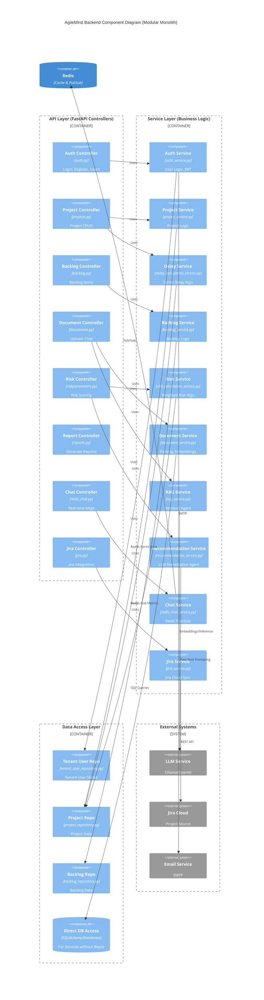

# AgileMind Component Diagram

This diagram visualizes the internal structure of the **Backend Monolith**, mapping the flow from API Controllers -> Business Services -> Data Access Layer.

```mermaid
C4Component
    title AgileMind Backend Component Diagram (Modular Monolith)

    Container_Boundary(api, "API Layer (FastAPI Controllers)") {
        Component(authCtrl, "Auth Controller", "auth.py", "Login, Register, Users")
        Component(projCtrl, "Project Controller", "projects.py", "Project CRUD")
        Component(backCtrl, "Backlog Controller", "backlog.py", "Backlog Items")
        Component(docCtrl, "Document Controller", "documents.py", "Upload, Chat")
        Component(riskCtrl, "Risk Controller", "riskparameters.py", "Risk Scoring")
        Component(reportCtrl, "Report Controller", "reports.py", "Generate Reports")
        Component(chatCtrl, "Chat Controller", "redis_chat.py", "Real-time Msgs")
        Component(jiraCtrl, "Jira Controller", "jira.py", "Jira Integration")
    }

    Container_Boundary(services, "Service Layer (Business Logic)") {
        Component(authSvc, "Auth Service", "auth_service.py", "User Logic, JWT")
        Component(projSvc, "Project Service", "project_service.py", "Project Logic")
        Component(delaySvc, "Delay Service", "delay_calculation_service.py", "Sprint Delay Algo")
        Component(backSvc, "Backlog Service", "backlog_service.py", "Backlog Logic")
        Component(riskSvc, "Risk Service", "risk_calculation_service.py", "Weighted Risk Algo")
        Component(docSvc, "Document Service", "document_service.py", "Parsing, Embeddings")
        Component(ragSvc, "RAG Service", "rag_service.py", "Retrieval Agent")
        Component(recSvc, "Recommendation Service", "recommendation_service.py", "LLM Remediation Agent")
        Component(chatSvc, "Chat Service", "redis_chat_service.py", "Redis Pub/Sub")
        Component(jiraSvc, "Jira Service", "jira_service.py", "Jira Cloud Sync")
    }

    Container_Boundary(data, "Data Access Layer") {
        Component(tenantRepo, "Tenant User Repo", "tenant_user_repository.py", "Tenant User Tables")
        Component(projRepo, "Project Repo", "project_repository.py", "Project Data")
        Component(backRepo, "Backlog Repo", "backlog_repository.py", "Backlog Data")
        ComponentDb(directDb, "Direct DB Access", "SQLAlchemy/Databases", "For Services without Repos")
    }

    System_Boundary(ext, "External Systems") {
        System_Ext(llm, "LLM Service", "Ollama/OpenAI")
        System_Ext(jira, "Jira Cloud", "Project Source")
        System_Ext(mail, "Email Service", "SMTP")
    }

    ContainerDb(redis, "Redis", "Cache & PubSub")

    %% API to Service Calls
    Rel(authCtrl, authSvc, "Uses")
    Rel(projCtrl, projSvc, "Uses")
    Rel(projCtrl, delaySvc, "Uses")
    Rel(backCtrl, backSvc, "Uses")
    Rel(riskCtrl, riskSvc, "Uses")
    Rel(riskCtrl, recSvc, "Uses")
    Rel(docCtrl, docSvc, "Uses")
    Rel(docCtrl, ragSvc, "Uses")
    Rel(chatCtrl, chatSvc, "Uses")
    Rel(jiraCtrl, jiraSvc, "Uses")

    %% Service to Data Calls
    Rel(authSvc, tenantRepo, "Uses")
    Rel(projSvc, projRepo, "Uses")
    Rel(delaySvc, projRepo, "Reads Sprint Data")
    Rel(backSvc, backRepo, "Uses")
    Rel(riskSvc, projRepo, "Reads Risk Metrics")
    Rel(docSvc, directDb, "SQL Queries")
    Rel(chatSvc, redis, "Pub/Sub")

    %% Service to External Calls
    Rel(ragSvc, llm, "Embeddings/Inference")
    Rel(recSvc, llm, "Few-Shot Prompting")
    Rel(jiraSvc, jira, "REST API")
    Rel(authSvc, mail, "SMTP")
```
