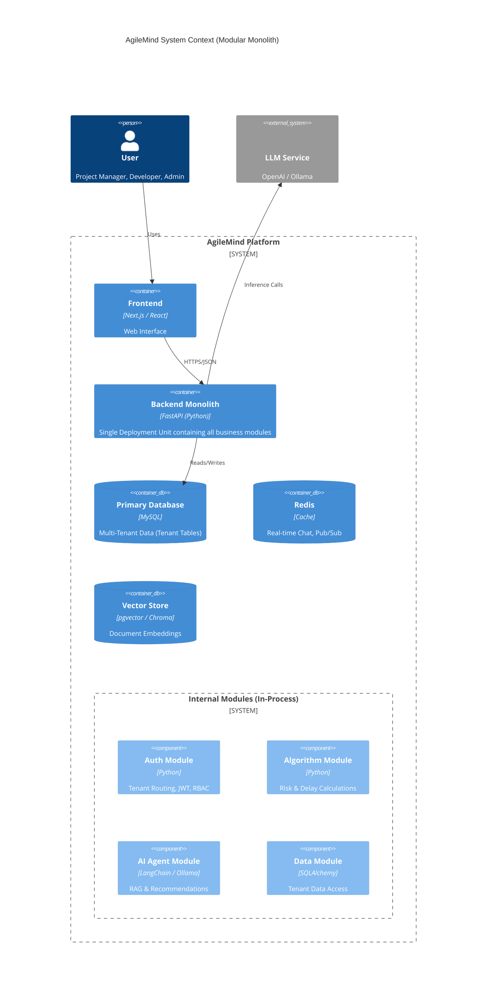

# AgileMind Platform Architecture

## 1. System Overview

AgileMind is a **multi-tenant SaaS platform** designed for agile project management. It is built as a **Modular Monolith** to ensure code cohesiveness and simplified deployment while maintaining logical separation of concerns.

The core differentiator of AgileMind is its deep integration of **Generative AI Agents** and **Project Risk Algorithms**, which move beyond simple tracking to active project intelligence.

---

## 2. High-Level Architecture (Modular Monolith)

The system is a single deployment unit (`FastAPI`) where "Services" are internal Python modules (packages). There is no separate API Gateway; the application itself handles routing and cross-cutting concerns (Auth, Logging) via middleware.

---

## 3. Core Algorithms & Logic

AgileMind implements specific mathematical models to quantify project health.

### 3.1. Delay Analysis Algorithm (Sprint-Based)
Calculates projected delays by comparing planned vs. actual sprint velocity.
*   **Formula Logic**: Iterative calculation over sprints.
    *   `Project Duration` = Sprint Count * Sprint Size (weeks).
    *   `Planned Completion` = Total Story Points / Planned Sprints.
    *   `Actual Completion Rate` = Completed Points / Elapsed Sprints.
*   **Risk Thresholds**:
    *   **LOW**: < 10% deviation.
    *   **MEDIUM**: 10% - 25% deviation.
    *   **HIGH**: 25% - 40% deviation.
    *   **CRITICAL**: > 40% deviation.

### 3.2. Weighted Risk Scoring Algorithm
Computes a `Risk Score` (0.0 - 1.0) aggregating multiple factors with specific weights.
*   **Risk Factors**:
    *   **Bugs**: Weighted by severity (`CRITICAL=3`, `HIGH=2`, `MEDIUM=1.5`, `LOW=1`).
    *   **Blockers**: Weighted severity of active blockers.
    *   **Timeline Conflicts**: Overlapping tasks or dependency violations.
    *   **Developer Workload**: Utilization rates (overloaded vs. idle).
*   **Calculation**:
    `Total Risk` = `Sum(Factor Score * Weight)` / `Max Possible Score`

---

## 4. AI & Agentic Capabilities

The platform uses **LangChain** and **Ollama/OpenAI** to power autonomous agents and few-shot reasoning.

### 4.1. Recommendation Agent
*   **Architecture**: Logic-free Agent.
    *   Instead of hardcoded "if-then" rules, the system sends a structured prompt with risk metadata to the LLM.
    *   **Few-Shot Prompting**: The prompt includes examples of "Good Recommendations" (actionable, specific) vs. "Bad Recommendations" to guide the model.
    *   **Output**: The LLM acts as an expert consultant, generating 3-5 specific remediation steps based on the context.

### 4.2. RAG (Retrieval-Augmented Generation) Module
*   **Purpose**: "Chat with your Documents" feature.
*   **Process**:
    1.  **Ingestion**: Files (PDF/DOCX) are uploaded.
    2.  **Chunking**: RecursiveCharacterTextSplitter (Size: 1000 chars, Overlap: 100).
    3.  **Embedding**: Vectorized and stored.
    4.  **Retrieval**: `Top-K` relevant chunks found via Cosine Similarity.
    5.  **Synthesis**: LLM answers user query strictly using retrieved context.

### 4.3. "Chain of Thought" Meeting Analysis
*   **Task Extraction**: Analyzes meeting transcripts (e.g., Daily Standups).
*   **Reasoning**: The AI explicitly generates a `ai_reasoning` field (Chain of Thought) explaining *why* it classified a task as "BLOCKED" or "DONE" before outputting the final status. This increases transparency and trust.

---

## 5. Domain-Based Multi-Tenancy

AgileMind uses a **Database-per-Tenant** strategy routed via Domain Extraction.

1.  **Identification**: `user@visionex.com` -> Domain `visionex`.
2.  **Routing**: Middleware intercepts request, extracts domain from JWT, and selects `visionex_db`.
3.  **Isolation**: Users in `visionex` cannot query `sliit` database tables.

---

## 6. Technology Stack

| Component | Technology | Role |
|---|---|---|
| **Backend** | **FastAPI (Python)** | Modular Monolith Main App. |
| **Database** | **MySQL** | Relational Data (Tenants, Projects). |
| **Vector DB** | **pgvector / Chroma** | Embeddings for RAG. |
| **AI Orchestration** | **LangChain** | Agent loops, Prompt Templates. |
| **LLM Inference** | **Ollama / OpenAI** | Intelligence Layer. |
| **Async Tasks** | **Celery + Redis** | Background Report Generation. |
