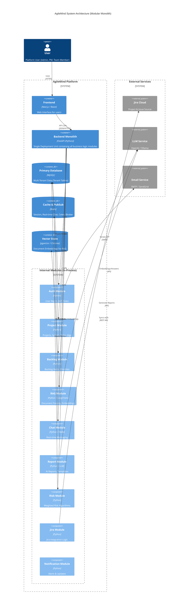

# AgileMind System Architecture

This document provides a high-level overview of the AgileMind system architecture using a C4 Container diagram.

## System Diagram

## Data Flow Description

1.  **Authentication**: Users log in via the Frontend. The **Backend Monolith** receives the request, and the internal `Auth Module` validates credentials against the `Primary Database` and issues JWT tokens.
2.  **Project Management**: Project Managers interact with the internal `Project Module` to manage projects and sprints. Data is stored in the `Primary Database`.
3.  **Jira Integration**: The `Jira Module` connects to external Jira Cloud instances to sync projects and issues, enabling a unified view within the platform.
4.  **RAG & Documents**: Users upload documents which are processed by the `Document Module`. Text is extracted and sent to the external `LLM Service` to generate embeddings. The `Global Chat` and `Chat with Document` features retrieve these contexts to answer user queries.
5.  **Real-time Chat**: Messaging utilizes the `Chat Module` backed by `Redis` for real-time pub/sub capabilities.
6.  **Reporting**: The `Report Module` uses the external `LLM Service` to generate intelligent summaries and reports (MOM, Retrospectives) based on meeting transcripts and templates.
